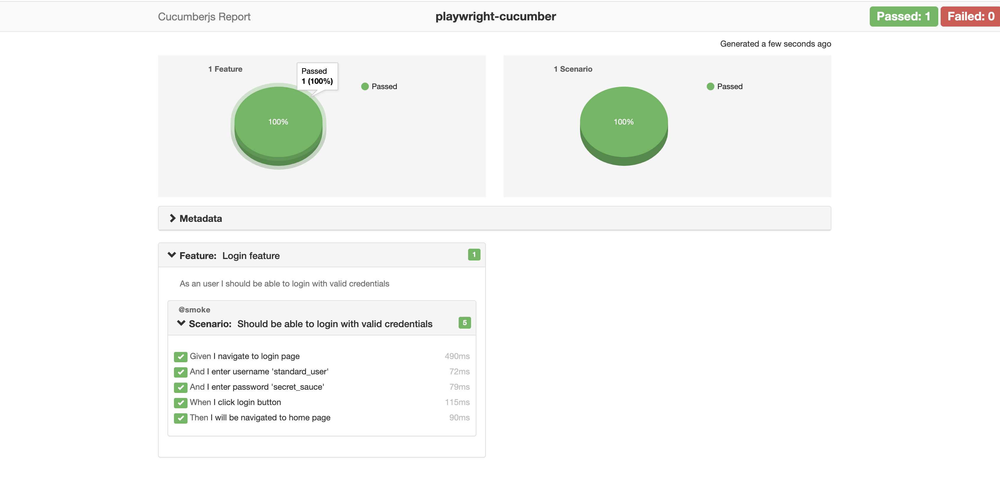

# playwright-cucumber[](https://github.com/ISanjeevKumar/playwright-cucumber/actions/workflows/playwright.yml)

Page object model design pattern for Playwright cucumber sample tests.

## step-by-step guide to getting started with Playwright cucumber

### Pre-requisite

- [x] Create a folder, then create the Node.js project using the following commands:

```
npm init
```

- [x] Add Playwright library as dependency to project

```
npm install playwright@latest
```

- [x] Add Cucumber library

```
npm i @cucumber/cucumber
```

- [x] Add Typescript library

```
npm i typescript
```

- [x] Add ts-node library to load typscript module

```
npm i ts-node
```

## How to run the test

Add below script in package.json file:

```
   "test": "cucumber-js features/*.feature  --require step-defs/*.ts --require-module ts-node/register"
```

Then execute the test with below command:

```
npm run test
```

or

Add the additional information in cucumber.js file instead of adding this in test scripts

```js
const options = [
  "--require-module ts-node/register", // to load typescript module
  "--require step-defs/*.ts", // load step defs classes
].join(" ");

let runsettings = [
  "features/*.feature", // feature files path
  options,
].join(" ");

module.exports = {
  runner: runsettings,
};
```

Then use below command to run your cucumber test scripts:

```
npx cucumber-js  -p runner
```

Note - you can use any of these approaches to run your test scripts

## How to write tests

Create global config to create and close browser for each test

```ts
import { After, Before } from "@cucumber/cucumber";
import { Page, Browser, chromium, BrowserContext } from "@playwright/test";

let page: Page;
let browser: Browser;
let context: BrowserContext;

Before(async () => {
  browser = await chromium.launch({ headless: false });
  context = await browser.newContext();
  page = await context.newPage();
});

After(async () => {
  await context.close();
  await browser.close();
});

// export page to access in test layer
export { page };
```

### Add Feature file as shown in below example:

```gherkin
Feature: Login feature

    As a user I should be able to login with valid credentials

    @smoke
    Scenario: Should be able to login with valid credentials
        Given I navigate to login page
        And I enter username 'standard_user'
        And I enter password 'secret_sauce'
        When I click login button
        Then I will be navigated to home page
```

### Add Step defs class for feature file like below:

```ts
import { Given, When, Then } from "@cucumber/cucumber";
import { page } from "../config/global-setup";

Given("I navigate to login page", async function () {
  await page.goto("https://www.saucedemo.com/");
});

Given("I enter username {string}", async function (username) {
  await this.page.locator("#user-name").fill(username);
});

Given("I enter password {string}", async function (password) {
  await this.page.locator("#password").fill(password);
});

When("I click login button", async function () {
  await this.page.locator("#login-button").click();
});

Then("I will be navigated to home page", async function () {
  await expect(this.page).toHaveTitle("Swag Labs");
});
```

## How to use page objects desing pattern in Playwright cucumber

Create page class as shown in below example of LoginPage:

```ts
import { expect, Page } from "@playwright/test";

export class LoginPage {
  protected readonly page: Page;

  constructor(page: Page) {
    this.page = page;
  }

  public async enterUsername(username: string) {
    await this.page.locator("#user-name").fill(username);
  }

  public async enterPassword(password: string) {
    await this.page.locator("#password").fill(password);
  }

  public async clickOnLogin() {
    await this.page.locator("#login-button").click();
  }

  public async isUserLoggedIn() {
    await expect(this.page).toHaveTitle("Swag Labs");
  }
}
```

All the page objects will be provided to you by app class as shown in below example:

```ts
export class SauceApp {
  protected readonly page: Page;

  constructor(page: Page) {
    this.page = page;
  }

  public get LoginPage(): LoginPage {
    return new LoginPage(this.page);
  }
}
```

Now we need to create an instance of this app class in test layer to access page objects.

```ts
import { After, Before } from "@cucumber/cucumber";
import { Page, Browser, chromium, BrowserContext } from "@playwright/test";
import { SauceApp } from "../page-objects/sauce-demo/SauceApp";

Before(async () => {
  browser = await chromium.launch({ headless: false });
  context = await browser.newContext();
  page = await context.newPage();
  sauceApp = await new SauceApp(page);
});
export { page, sauceApp };
```

In step defs class , we can access sauceApp instance like this:

```ts
import { Given, When, Then } from "@cucumber/cucumber";
import { page, sauceApp } from "../config/global-setup";

Given("I navigate to login page", async function () {
  await page.goto("https://www.saucedemo.com/");
});

Given("I enter username {string}", async function (username) {
  await sauceApp.LoginPage.enterUsername(username);
});

Given("I enter password {string}", async function (password) {
  await sauceApp.LoginPage.enterPassword(password);
});

When("I click login button", async function () {
  await sauceApp.LoginPage.clickOnLogin();
});

Then("I will be navigated to home page", async function () {
  await sauceApp.LoginPage.isUserLoggedIn();
});
```

### How to generate report

Install cucumber-html-reporter using below command:

```
npm install cucumber-html-reporter
```

Then create a Typescript file and add below information in it:

```ts
var reporter = require("cucumber-html-reporter");

var options = {
  theme: "bootstrap",
  jsonFile: "test-report/cucumber_report.json",
  output: "test-report/cucumber_report.html",
  screenshotsDirectory: "test-report/assets/",
  storeScreenshots: true,
  reportSuiteAsScenarios: true,
  scenarioTimestamp: true,
  launchReport: true,
  metadata: {
    Platform: "Mac",
    Parallel: "Scenarios",
    Executed: "Remote",
  },
};
reporter.generate(options);
```

Now we need to add entry for creating json file for each test run

```ts
const options = [
  "--require-module ts-node/register",
  "--require step-defs/*.ts",
  "-f json:test-report/cucumber_report.json", // for json report
].join(" ");
```

Now add the below command in test scripts to run this node js file

```
Node reporter-config.ts
```

JSON files can be converted into beautiful HTML reports with the help of reporter-config

#### HTML report sample:



### Framework Capabilities

- [x] Page object model design pattern
- [x] Cucumber HTML report
- [x] Retry failure test
- [x] Parallel execution
- [x] Cross browser tests
